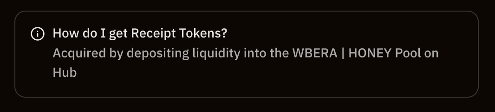
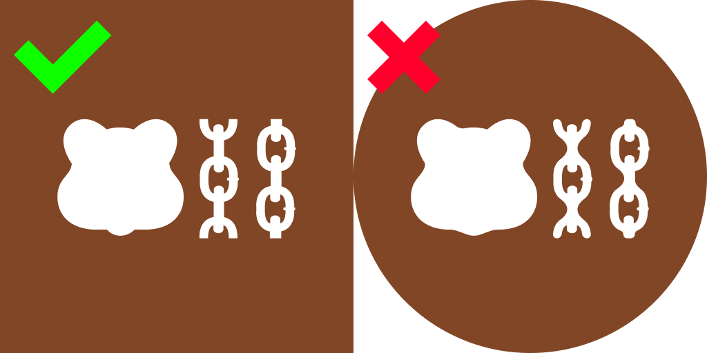

# Contributing To Berachain Metadata

## Making A Pull Request

Make sure to do the following:
1. Fork this repository
2. Make your changes
3. Run `pnpm validate` to ensure your changes are valid
4. Submit a Pull Request and PLEASE ALLOW MAINTAINERS TO EDIT THIS PULL REQUEST

PLEASE NOTE:
- Submitting a PR _DOES NOT_ guarantee addition to the lists
- All PRs should include relevant assets in the `assets/` directory

### Adding a Token

```json
{
  "chainId": 80094,
  "address": "0x688e72142674041f8f6Af4c808a4045cA1D6aC82",
  "symbol": "BYUSD",
  "name": "BYUSD",
  "logoURI": "https://res.cloudinary.com/duv0g402y/image/upload/v1738732576/tokens/y6wa21vehnappbe2cruf.png",
  "decimals": 6,
  "tags": ["stablecoin", "featured"]
}
```

> **NOTE:** If adding an image, give it the same name as the `address`:

_Example:_
```
src/assets/tokens/0x688e72142674041f8f6Af4c808a4045cA1D6aC82.png
```

#### Required Fields:

- `chainId`: Chain ID of the network (`80094` for mainnet)
- `address`: Token contract address
- `symbol`: Token symbol
- `name`: Token name
- `logoURI`: Path to token icon
- `decimals`: Token decimal places
- `tags`: Array of tags (can leave empty)

### Adding a Vault

> PLEASE NOTE: If adding a vault, please link to the governance proposal that passed. ONLY Whitelisted Vaults will be considered to be added to the Berachain Metadata.

```json
{
  "stakingTokenAddress": "0x2c4a603a2aa5596287a06886862dc29d56dbc354",
  "vaultAddress": "0xc2baa8443cda8ebe51a640905a8e6bc4e1f9872c",
  "name": "WBERA | HONEY",
  "logoURI": "https://res.cloudinary.com/duv0g402y/image/upload/v1738378469/reward-vaults/icons/soy9mfpovb1odtby9p02.png",
  "protocol": "HUB",
  "url": "https://hub.berachain.com/pools/0x2c4a603a2aa5596287a06886862dc29d56dbc354000200000000000000000002/details/",
  "description": "Acquired by depositing liquidity into the [WBERA | HONEY Pool](https://hub.berachain.com/pools/0x2c4a603a2aa5596287a06886862dc29d56dbc354000200000000000000000002/details/) on Hub"
}
```

> **NOTE:** If adding an image, give it the same name as the `stakingTokenAddress`:

_Example:_
```
src/assets/tokens/0x2c4a603a2aa5596287a06886862dc29d56dbc354.png
```

#### Required Fields:

- `stakingTokenAddress`: Address of the token being staked
- `vaultAddress`: Vault contract address
- `name`: Vault name
- `logoURI`: Path to vault icon
- `protocol`: Protocol name
- `url`: Hub URL for the vault
- `description`: A small text about how to get the staking token, more details in the section below


#### Vault Description

The description field is optional but can be added to provide information about how to get the LP token. 




It can be a plain string but it also supports MarkDown syntax. Allowed tags are links, italic and bold.

For instance, 

> `Acquired by _depositing liquidity_ into the [WBERA | HONEY Pool](https://hub.berachain.com/pools/0x2c4a603a2aa5596287a06886862dc29d56dbc354000200000000000000000002/details/) on **Hub**` 

will be displayed as

> Acquired by _depositing liquidity_ into the [WBERA | HONEY Pool](https://hub.berachain.com/pools/0x2c4a603a2aa5596287a06886862dc29d56dbc354000200000000000000000002/details/) on **Hub**

### Adding a Validator

```json
{
  "id": "0x960052c5509caa280218f3ecf3da7ba5bf4ec20b97e6c52700dd93515ef4e963813aa92a8731c9e137b1027dbc77102f",
  "logoURI": "https://res.cloudinary.com/duv0g402y/raw/upload/src/assets/Lugahill_square.png",
  "name": "Luganodes",
  "description": "Swiss-Operated Institutional Grade Staking Provider",
  "website": "https://luganodes.com",
  "twitter": "https://x.com/luganodes"
}
```

> **NOTE:** If adding an image, give it the same name as the `id`:

_Example:_
```
src/assets/validators/0x960052c5509caa280218f3ecf3da7ba5bf4ec20b97e6c52700dd93515ef4e963813aa92a8731c9e137b1027dbc77102f.png
```

#### Required Fields:

- `id`: Validator public key
- `logoURI`: Path to validator icon
- `name`: Validator name
- `description`: A short description for the validator (optional)
- `website`: Validator's website (optional)
- `twitter`: Validator's twitter account URL (optional)

### Asset Guidelines

- Upload assets to the `assets/` directory
- Use PNG or JPG format with solid background (no transparency) - Other formats are not supported
- Size needs to be: 1024x1024 pixels



